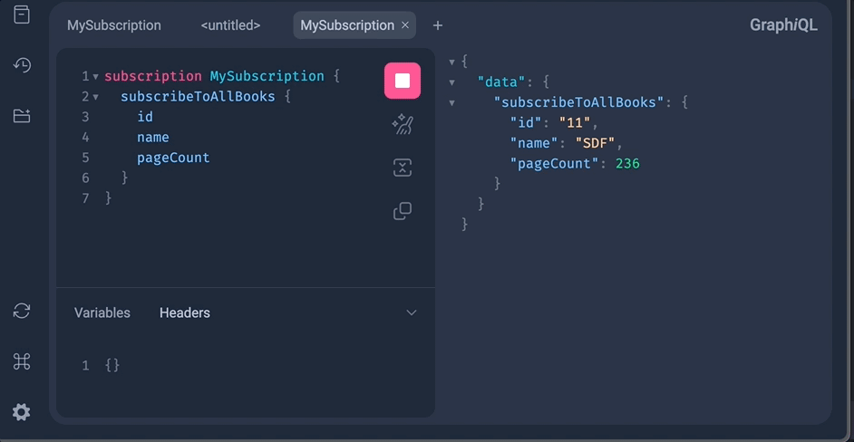

## GraphQL Subscription with SpringBoot Webflux

### Demo


### Getting Started

```agsl
./gradlew bootRun
```

URL: http://localhost:8080/graphiql

### Important Considerations

#### Application Properties
Websocket path is important
```agsl
spring:
  graphql:
    graphiql:
      path: /graphiql
      enabled: true
    path: /graphql
    websocket:
      path: /subscription
```

#### Key Dependencies

```agsl
  implementation 'org.springframework.boot:spring-boot-starter-graphql'
  implementation 'org.springframework.boot:spring-boot-starter-web'
  implementation 'org.springframework.boot:spring-boot-starter-websocket'
```


